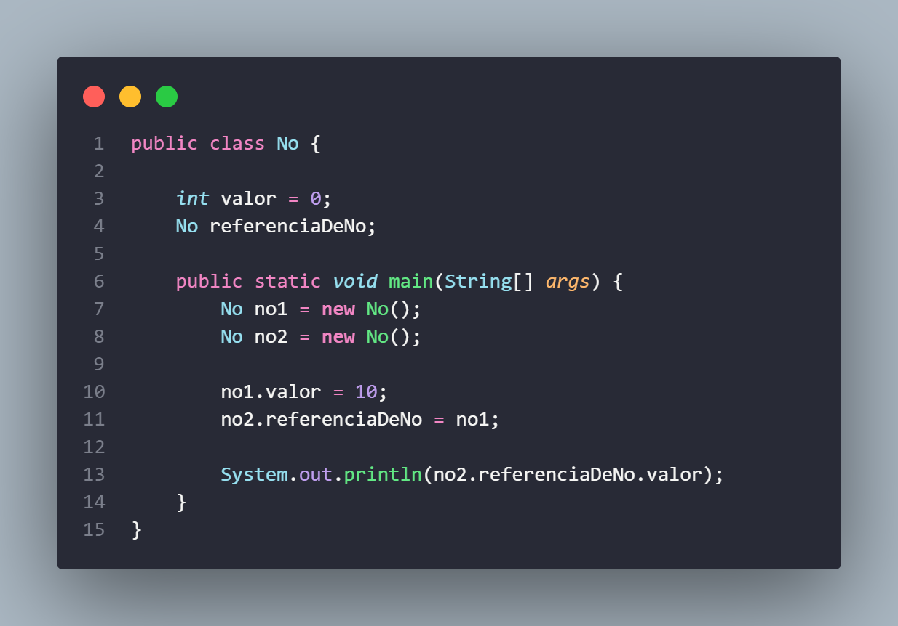

<h3>Nó</h3>

O Nó é uma parte de uma estrutura de dados maior, basicamente ele guarda as informações dos dados de um tipo primitivo de dados ou objetos que iremos guardar, também guardam as referências de um outro Nó, como assim: bom é possível guardar objetos do mesmo tipo dentro de outro objeto mas não estamos guardando totalmente aquele objeto somente o local dele na memória assim conseguimos acessar valores um 2º objeto do 1º objeto, podendo usar isso como um encadeamento (sim pode parecer confuso mas em código se torna mais fácil de compreender). 
O Nó define como a gente consegue acessar e manipular os elementos da estrutura de dados. Por exemplo, se a gente quiser percorrer todos os elementos de uma lista encadeada, basta seguir as referências de nó em nó, até chegar ao final da lista. 

Este print retorna o valor 10 do no1, sendo acessado pelo no2.

 
<a href="https://github.com/Alrykemes/Estruturas-de-dados/blob/main/No/No.java">
Acesse o arquivo do NÓ.
</a>

